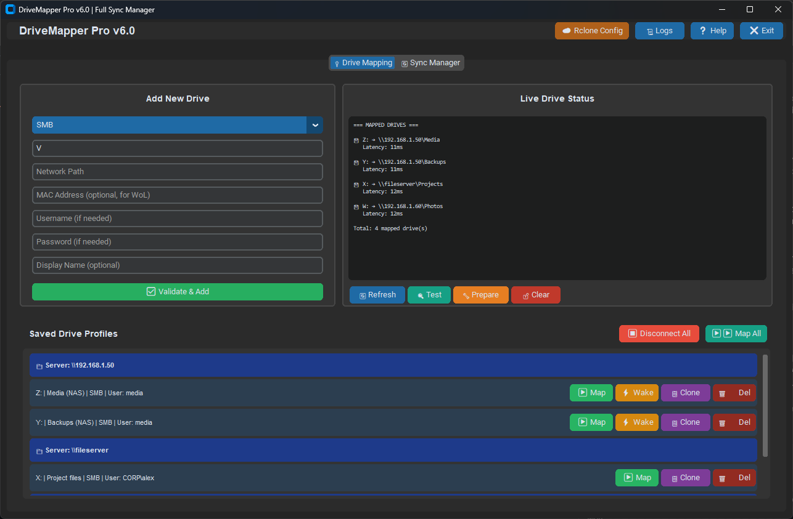

# DriveMapper Pro

A free Windows GUI for people who manage lots of network drives: map SMB shares, wake sleeping servers, fix the dreaded **Error 1219**, and keep folders in sync with **rclone** or **robocopy** - all from one window.

> Built by a working IT technician for real-world file-server and home-lab use. Free to use, free to change.

## Screenshots


*Drive mapping with saved profiles and live status (fictional demo data)*

## Features

- **Drive mapper** - map/unmap network drives, pick drive letters, save credentials per share
- **Error 1219 handling** - detects conflicting credentials to the same server and helps you fix them
- **Wake-on-LAN** - send a magic packet to a server before mapping it
- **Sync Manager** - bidirectional and one-way sync between local folders, SMB shares, cloud and FTP
  - **rclone** (bisync / sync) for cloud, FTP, SFTP, WebDAV
  - **robocopy** (mirror / copy) for local folders and SMB shares
  - save reusable sync profiles, one-click run
- **Event log** - every action is logged to `drive_events.log`
- Keyboard shortcuts: `Alt+H` help, `Alt+Q` quit

## Requirements

- Windows 10 / 11 (uses the Win32 network APIs)
- Python 3.9+ (only if running from source)
- [rclone](https://rclone.org/downloads/) on your `PATH` (only for cloud/FTP sync; robocopy ships with Windows)

## Quick start

```powershell
git clone https://github.com/ronaldgoodchild/drivemapper-pro.git
cd drivemapper-pro
pip install -r requirements.txt
python drivemapper_pro.py
```

Prefer a ready-to-run program? Grab the `.exe` from the [Releases](../../releases) page.

On first run the app creates `network_vault.json` (your saved drives), `sync_profiles.json` and `drive_events.log` in the folder you launch it from. See `network_vault.example.json` for the format.

## Documentation

- [Quick start guide](docs/QUICK_START.txt)
- [Sync Manager guide](docs/SYNC_MANAGER.txt)
- [Full user manual](docs/USER_MANUAL.txt)

## Security

Share passwords are stored in **Windows Credential Manager** (service `DriveMapperPro`, one entry per drive letter), not in `network_vault.json`. The JSON file only records the drive letter, path, username and label. An older plain-text vault is migrated automatically the first time you launch this version.

If the `keyring` package is missing the app warns you and falls back to plain text rather than losing your passwords - run `pip install keyring`. Still, treat `network_vault.json` as private and never commit it (it is in `.gitignore`).

## Contributing

Bug reports, ideas and pull requests are welcome - see [CONTRIBUTING.md](CONTRIBUTING.md). Look for issues labelled `good first issue`.

## License

[MIT](LICENSE) (c) 2026 Ronald Goodchild / REGTeches
